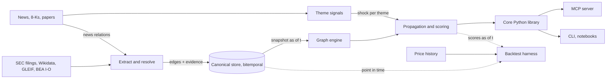

# Ripple: technical plan

A knowledge graph that turns news about trends into ranked, explained exposure
for public companies, including companies three or four hops away from the
headline.

## Summary

- **NLP is the intake, not the core.** The value sits in an exposure graph plus a propagation model. NLP builds and maintains the graph and detects what is changing; the graph turns a change into a ranked list of affected companies, each with a path that explains why.
- **Two layers.** A value-chain layer of products and technologies (accelerators require leading-edge chips, which require EUV lithography) sits above a company layer (ASML produces EUV scanners). Non-obvious links come from walking the value chain, which is more stable and better documented than company-to-company links.
- **Edges carry quantities from day one.** Demand shares and revenue shares make a shock shrink as it travels. That is why rising grocery demand barely moves Amazon: grocery is a small share of its revenue.
- **"Non-obvious" gets a number.** Rank by high exposure combined with low attention, where attention is how often the news already pairs the company with the trend.
- **Build on a hand-made slice first** (Phase 0), then automate extraction, then backtest on point-in-time data.

## 1. The core idea

Three problems that change at different speeds:

- **Structure**: what depends on what. Changes over quarters. Built from filings and reference data.
- **Signal**: what is changing now. Changes over hours and days. Built from news, press releases and filings.
- **Reasoning**: who is exposed, how much, and why. Pure computation over the other two.

Prior evidence: Cohen and Frazzini, "Economic Links and Predictable Returns" (Journal of Finance, 2008), found that supplier stock prices lag news about their principal customers because investors have limited attention. Ripple generalizes this from direct customer-supplier links to multi-hop paths through a value chain. Published effects like this tend to shrink once widely known, so treat it as evidence the mechanism is real, not as an expected return.

## 2. Graph model

### Node types

| Type | Examples | Canonical ID |
|---|---|---|
| Company | ASML, Vertiv | SEC CIK, LEI, Wikidata QID; tickers via OpenFIGI |
| Product / technology | EUV lithography, HBM, liquid cooling | own taxonomy slug, Wikidata QID where one exists |
| Material | copper, neon, gallium | taxonomy slug |
| Theme | AI compute demand, grocery demand | taxonomy slug; attaches to products, never directly to companies; kind is volume or share_shift |
| Region | Taiwan, EU | ISO 3166 |
| Policy | an export control, a tariff | slug plus defining document |
| Document | a 10-K, an article | evidence only, not traversed |

### Edge types

| Edge | From → to | Sign | Transfer quantity |
|---|---|---|---|
| DRIVES | theme → product | + or − | share of the product's demand driven by the theme |
| REQUIRES | product → input | + | share of the input's demand coming from this product |
| PRODUCES | company → product | + | share of the company's revenue from this product |
| SUPPLIES | company → company | + | share of the supplier's revenue from this customer |
| SUBSTITUTES | product ↔ product | − | only for share-shift shocks (see below) |
| COMPETES_WITH | company ↔ company | ± | share-shift events, not demand shocks |
| SUBSIDIARY_OF | company → company | + | subsidiary's share of parent revenue |
| EXPOSED_TO | company → region | ± | share of revenue or capacity in the region |
| CONSTRAINS | policy → product or company | − | bucketed severity |

Substitution: a substitute edge must not carry volume growth. If total datacenter capacity grows, liquid and air cooling can both grow. Substitution is modeled as a share-shift theme with a positive DRIVES edge to the winner and a negative one to the loser.

### Edge record

Every edge carries provenance and is **bitemporal**: `valid_from` / `valid_to` is when the fact was true in the world, `recorded_at` is when the system learned it. Backtests query "what did we know on date t". This is expensive to retrofit, so it exists from Phase 0.

## 3. Magnitude

Knowing a link exists is the easy half. The graph carries quantities and propagation multiplies them.

- **Demand share** on DRIVES and REQUIRES edges. If accelerators are 40% of leading-edge wafer demand and accelerator demand grows 20%, wafer demand grows about 8%. Growth rates compose along a path as a weighted sum, like an economic input-output model.
- **Revenue share** on PRODUCES edges. This is the dilution step. Market share mostly drops out: if a market grows 10% and shares hold, each producer's product line grows about 10%. What differs is how much of each company that line represents.
- **Shock size** at the theme. The hardest input. Version 1 uses relative units (a velocity z-score); later versions extract stated forecasts or tie themes to reported figures.

Worked example, grocery demand +5% (illustrative): a pure-play grocer with ~0.9 of revenue in grocery moves about +4.5%; Amazon, with its physical stores line at ~0.03 of revenue, moves about +0.15%. Amazon also sells groceries online, so several revenue lines can map to one product node.

Sources for numbers: XBRL segment and disaggregated revenue from 10-K/20-F filings (revenue shares); BEA input-output use tables (default industry-level demand shares); buckets as fallback (core 0.6 / meaningful 0.25 / minor 0.05), always with `weight_source` recorded.

Later refinements: profit rather than revenue (segment operating income), capacity and pricing (a sole-source supplier gains through price), timing and lags per edge type (the bullwhip effect on equipment makers), and transfer coefficients calibrated from backtests.

## 4. Architecture



The canonical store is the single source of truth. The graph engine loads a snapshot for a chosen date, and the backtest harness replays past dates through the same scoring code the MCP server uses.

## 5. Data sources

Structure:

- **SEC EDGAR 10-K**: business description (Item 1), risk factors (Item 1A), segment and disaggregated revenue via XBRL, customers above 10% of revenue. Free; send a descriptive User-Agent and stay under 10 requests per second.
- **SEC 20-F / 40-F**: foreign issuers listed in the US (ASML, TSMC). Many Japanese, Korean and European materials suppliers do not file with the SEC.
- **Wikidata**: manufacturer, products produced, parent and subsidiary, aliases.
- **GLEIF LEI**: legal entity IDs and ownership trees.
- **OpenFIGI**: ticker mapping.
- **BEA input-output tables**: default demand shares.
- **Earnings call transcripts**: optional, usually paid.

Signals:

- **GDELT DOC 2.0 API**: article lists and coverage-volume timelines (officially the last ~3 months; raw GKG files for history).
- **EDGAR 8-K feed**: material events.
- **arXiv, patents**: technology trends before they reach the news.
- **Year-over-year 10-K diffs**: new terms appearing across many filings.
- **Google Trends**: official API is an application-gated alpha and pytrends is archived; optional.

Store extracted facts, URLs and character offsets, not full article text.

## 6. Extraction pipeline

1. **Chunk by section**: filings by item, news by sentence.
2. **Recognize entities**: GLiNER small models (zero-shot labels, CPU).
3. **Resolve entities** (the hardest part): alias tables from EDGAR, Wikidata and tickers; blocking plus small-embedding candidate generation; context disambiguation; a review queue for unresolved mentions. Products need a curated taxonomy and a merge queue so "EUV machines" and "EUV lithography systems" land on one node.
4. **Extract relations**: an LLM via batch API with a strict JSON schema limited to the edge types above, picking entities from the candidate list and returning the supporting span. Reject any edge whose span does not contain both mentions. For news, GLiNER's relation models triage sentences on CPU and only flagged sentences go to the LLM. A separate step maps reported revenue lines to product nodes with shares. (GLiREL is CC BY-NC-SA: fine for personal use, not commercial.)
5. **Consolidate**: confidence from source reliability, extractor, number of independent sources and recency. Low-confidence edges stay candidates and do not propagate; unconfirmed edges decay.

## 7. Trend signals

- Seed ~50 themes by hand, each linked to the products it drives.
- Discover new themes with BERTopic over weekly article embeddings.
- Per theme per day: coverage share and a z-score of its change against a trailing 90-day window; burst detection (CUSUM or Kleinberg).
- Classify direction, not sentiment: "shortage of power transformers" is negative sentiment and good news for transformer makers. Labels: demand up, demand down, supply constrained.

Output: a shock vector (signed magnitude and timestamp per theme).

## 8. Scoring and paths

Propagation: one sparse matrix of signed transfers along the demand flow, shock pushed through for up to 5 hops. Edges below a confidence threshold are excluded; confidence is reported per path, not multiplied into the transfers.

```python
def propagate(W, shock, hops=5):
    x = shock.astype(float)
    total = np.zeros(W.shape[0])
    for _ in range(hops):
        x = W.T @ x      # advance every path by one hop
        total += x       # sum over path lengths
    return total         # at company nodes: revenue impact per unit shock
```

Shares below 1 make effects shrink with distance on their own; a separate decay factor is only an uncertainty discount.

Explanations: k strongest paths per company via Yen's k-shortest-paths on −log |weight|, each edge linked to its evidence. These paths are what an MCP caller reads and narrates.

Novelty:

- **Attention** A(c, θ): share of theme-θ articles in the last 90 days that mention company c.
- **Novelty** = exposure × (1 − percentile of A).
- **Priced-in check**: correlation between the company's recent returns and the theme signal. Needs price history, so it is built in Phase 4, not Phase 3.

Later: knowledge-graph embeddings (PyKEEN) and LLM-proposed inputs to suggest missing edges, accepted only when evidence retrieval finds support.

## 9. Evaluation

Graph quality: precision on 200 hand-labeled edges per type; recall against held-out 10%-customer disclosures; entity-resolution accuracy on labeled mentions.

Signal quality (event study): for each theme burst at date t, rank companies by novelty using the graph as recorded on t; measure abnormal returns over 20 and 60 trading days against a sector benchmark; compare the top decile with directly co-mentioned companies, same-industry companies, and random picks.

Traps: lookahead (prevented by the bitemporal store), survivorship (price data must include delisted names), overfitting (fix parameters on one period, test on a later untouched one), costs and illiquid small caps.

The realistic value is a research tool that surfaces and explains leads. The backtest checks whether exposure scores carry information.

## 10. MCP interface

The core library holds all logic; the MCP server and CLI are thin wrappers. The MCP spec released 2026-07-28 has a stateless request/response core, supported by the official Python SDK v2.

| Tool | Inputs | Returns |
|---|---|---|
| search_entities | query, type | candidate IDs with labels and tickers |
| find_exposed | theme, product or material ID, direction, max_hops, hide_obvious, as_of, limit | ranked companies with exposure, attention, novelty, confidence, top 3 paths |
| explain_link | from_id, to_id, k, as_of | strongest paths with source, date and URL per edge |
| company_profile | company_id, as_of | revenue mix by product, neighbors, exposure per theme (never summed), attention |
| trending_themes | window, min_surprise, as_of | bursts with window, surprise, ratio, matched count, tone flag and the theme's kind; no articles and no live GDELT call (phase-3.md, D112) |
| get_evidence | edge_id, as_of | documents behind one edge, with verification ruling, source layer and losing alternatives |

Return compact JSON with IDs and labels, rounded scores, and `as_of` and confidence on every result. Every query accepts `as_of`.

## 11. Stack

| Layer | Choice |
|---|---|
| Canonical store | DuckDB file; Postgres + pgvector when concurrent writers are needed |
| Graph compute | scipy.sparse for propagation; networkx (Phase 0) then rustworkx or igraph for paths |
| Graph database | optional; Neo4j Community for Cypher and visual browsing. Kuzu was archived in October 2025; forks exist. |
| NER and triage | GLiNER small models |
| Embeddings | small sentence-transformer (bge-small class) |
| Relation extraction | LLM via batch API with structured output |
| Topics | BERTopic |
| MCP | official MCP Python SDK v2 |
| Scheduling | cron and a jobs table; Prefect or Dagster later |

Designed to run on a laptop; the only heavy step (LLM extraction over filings) goes to a batch API.

## 12. Roadmap

| Phase | Name | Size | Done when |
|---|---|---|---|
| 0 | Hand-built slice | S | every ranked company has a readable path; ranking passes your sanity check |
| 1 | Structure from filings | L | edge precision ≥ 85% on 200 labeled edges; resolution accuracy measured |
| 2 | Signals | M | known past events show up as bursts on the right themes with the right direction |
| 3 | Scoring and full MCP surface | M | a model using only the MCP tools can write a sourced thematic brief: three Codex briefs, every citation resolved, passed against a rubric fixed in advance (`docs/phase-3.md`) |
| 4 | Evaluation | L | you know whether novelty-ranked companies beat the baselines, and by how much |
| 5 | Magnitude (later) | L | predicted revenue impact correlates with later reported segment growth |
| 6 | Graph completion (later) | M | accepted suggestions match the precision of extracted edges |

Sizes: S is a weekend or two, M a few weeks, L a month or more.

## 13. Risks

| Risk | Mitigation |
|---|---|
| Entity and product fragmentation | curated taxonomy, merge queue, review queue |
| Hallucinated edges | require a supporting span containing both mentions |
| Missing or guessed weights | buckets with recorded source; sensitivity analysis |
| Stale edges | `last_confirmed` plus confidence decay |
| Lookahead bias | bitemporal store from Phase 0 |
| Coverage gaps outside SEC filers | Wikidata and news; report coverage with results |
| Sign errors (shortages, substitutes) | polarity per edge; direction classifier instead of sentiment |
| Overconfident output | confidence and `as_of` on every result; leads, not recommendations |
| Content licensing | store facts, links and offsets, not article text |
